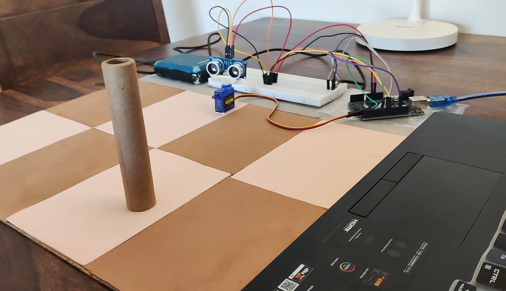
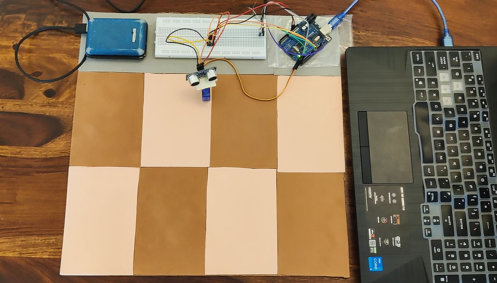
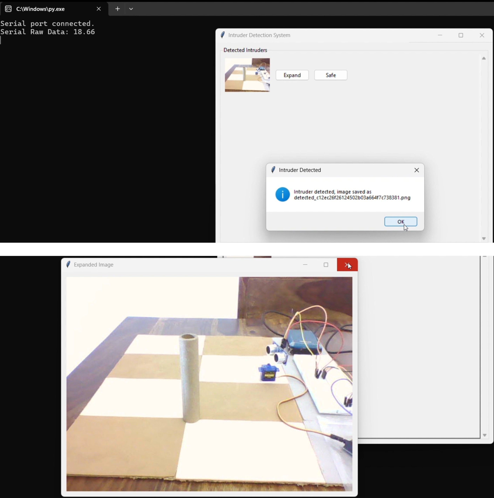
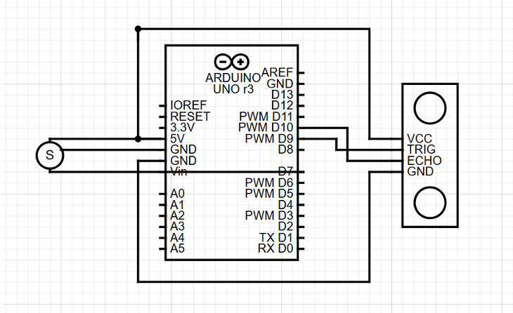

# Intruder Detection System

An IoT-based intruder detection system that combines real-time scanning and image capture for smart perimeter security. It uses an **ultrasonic sensor mounted on a servo motor** to scan a 180° area. When an object is detected, the system sends an alert, activates a **camera** to capture an image, and displays it in a **Python-based GUI software** where a supervisor can classify the object as *safe* or *intrusive*.

Designed for applications such as **border security**, **private property protection**, and **smart surveillance systems**.

---

## Project Overview

This image shows the full setup of the intruder detection system, including the servo, ultrasonic sensor, and camera.

---

## Detection Process

This is an example of a detection event. When an intruder is sensed, the system captures an image and displays it for the supervisor to classify.

---

## Software Interface

The software interface shows the captured image and allows the supervisor to classify the object as *safe* or *intruder*.

---

## Components Used

### Hardware
- Arduino Uno
- HC-SR04 Ultrasonic Sensor
- SG90 Servo Motor
- USB Webcam
- Power Bank (for powering the servo)
- Jumper wires, breadboard
- Buzzer / LED (optional for alert)

### Software
- Python 3.x (for GUI and camera)
- PySerial (communication with Arduino)
- OpenCV (image capture and display)
- Tkinter or PyQt (GUI)
- Arduino IDE

---

## System Workflow

1. **Servo + Ultrasonic** sweep the area.
2. **Object detected** → Arduino sends signal via serial.
3. **Python app** captures photo from webcam.
4. Image shown in GUI with **"Safe" / "Intruder"** classification options.
5. **Servo stops rotating** when an object is detected and keeps monitoring.
6. When the **intruder is gone**, the servo **resumes scanning**.

---

## Setup Instructions

This diagram shows the circuit for the intruder detection system, including connections for the Arduino, servo motor and ultrasonic sensor.

1. Upload the Arduino code to your board.
2. Connect hardware components as per the circuit diagram.
3. Use a **power bank** to power the servo, ensuring the **Arduino and servo share a common ground**.
4. Run `main.py` (or your GUI file) on your computer.
5. Monitor area → Classify images on detection.

---
